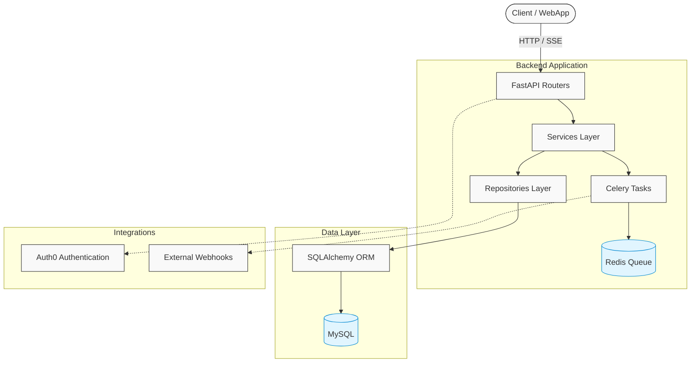

# Agriculture Handling API


> Comprehensive API for agricultural campaign management, plots, events, and technical recommendations.
> Automates processes, integrates notifications, and visualizes key metrics for producers, advisors, and administrators.

## Features

- **Campaign & Plot Management**: Producers can register and manage agricultural campaigns and land plots seamlessly.
- **Event Tracking**: Create and track agricultural events (e.g., fertilization, sowing) throughout the campaign lifecycle.
- **Real-time Notifications**: Automatic notifications delivered via Server-Sent Events (SSE) and stored in the database.
- **Technical Recommendations**: Advisors can provide detailed recommendations on plots and campaigns.
- **Admin Dashboard**: Comprehensive dashboard for administrators to track costs, yields, and system metrics.
- **Export Capabilities**: Export reports and metrics in standard formats (Excel/PDF).

## Architecture

The project follows a layered architecture pattern, separating concerns and enforcing strict transaction boundaries.



### Architecture Decision Records (ADRs)

Key architectural decisions are documented as ADRs in the `docs/` directory to track the technical evolution of the project.
You can find the details in the [Documentation section](docs/README.md).

## Technology Stack

| Layer                | Technology                              |
| -------------------- | --------------------------------------- |
| **Backend Framework**| FastAPI (Async/Await)                   |
| **ORM & Database**   | SQLAlchemy 2.0, Alembic, MySQL          |
| **Authentication**   | Auth0 + JWT (Refresh Token Rotation)    |
| **Async Processing** | Celery + Redis                          |
| **Notifications**    | Server-Sent Events (SSE)                |
| **Containerization** | Docker & Docker Compose                 |
| **Observability**    | Loguru                                  |
| **Testing**          | Pytest                                  |

## Project Structure

| Path                                        | Description                                                            |
| ------------------------------------------- | ---------------------------------------------------------------------- |
| **`src/`**                                  | Main source code of the application.                                   |
| **`src/api/v1/`**                           | API endpoints and route definitions (FastAPI routers).                 |
| **`src/core/`**                             | Project configuration (settings, security, logging, middleware, etc.). |
| **`src/db/`**                               | Database connection and session management.                            |
| **`src/models/`**                           | Declarative SQLAlchemy models (database tables).                       |
| **`src/schema/`**                           | Pydantic schemas for data validation and serialization.                |
| **`src/repositories/`**                     | Data access layer (SQL interactions, flush operations).                |
| **`src/services/`**                         | Business logic and transactional orchestration.                        |
| **`src/exceptions/`**                       | Custom exception definitions mapped to HTTP errors.                    |
| **`alembic/`**                              | Database migrations managed by Alembic.                                |
| **`tests/`**                                | Unit and integration tests.                                            |
| **`docs/`**                                 | Technical and architecture documentation (including ADRs).             |

## Quick Installation

### Prerequisites

- Docker & Docker Compose
- Python 3.11+
- `uv` (Fast Python package installer and resolver)

### Run with Docker

Build and start the services using Docker Compose:

```bash
docker-compose up --build
```
The API will be available at [http://localhost:8000](http://localhost:8000).

### Run Locally

For local development without Docker containers:

```bash
uv run dev
```
*Note: Make sure your environment variables and local database instances are properly configured.*

## Configuration (Environment Variables)

The project relies on environment variables for sensitive settings. Copy `.env.example` to `.env` and fill in the values.

| Variable Category | Key Variables | Description / Where to get it |
| :--- | :--- | :--- |
| **Application & Security** | `SECRET_KEY`, `ENVIRONMENT` | Core app settings. Generate a strong secret key for sessions/JWT. |
| **Database** | `DB_HOST`, `DB_USER`, `DB_PASSWORD`, `DB_NAME` | MySQL credentials. |
| **Auth0** | `AUTH0_DOMAIN`, `AUTH0_CLIENT_ID` | Required for authentication. Get these from your Auth0 tenant dashboard. |
| **Redis** | `REDIS_HOST`, `REDIS_PORT` | Celery broker and caching layer connection details. |
| **External Services** | `WEATHER_API_KEY`, `GOOGLE_CALENDAR_API_KEY` | Needed for integrations like forecasting and syncing events to Google Calendar. |

## Database Management

We use **Alembic** to manage database schemas. The models are mapped using SQLAlchemy 2.0.

### Running Migrations
To apply the latest schema changes to your database, run:
```bash
uv run alembic upgrade head
```

### Seeding the Database
*(If you have a seed script, run it as follows)*:
```bash
uv run python -m src.db.seed
```

## Testing

The project uses `pytest` for unit and integration testing. All new features require associated tests.

Run the test suite:

```bash
pytest
```

## CI/CD and Code Quality

Code quality is strictly enforced with pre-commit hooks to ensure consistency across the codebase:

- **Ruff**: Linting and auto-fixing syntax errors.
- **Pyright**: Static type checking.
- **Black**: Code formatting.

Run the linter manually:

```bash
uv run ruff check src
```

## Integrations & Extensions

- **Calendar Integration**: Trigger webhooks for Google Calendar events (e.g., scheduled sowing or fertilization).
- **External APIs**: Fetch and process external data, such as real-time grain prices.
- **Reporting Engine**: Generate and export reports in both Excel and PDF formats.

## Contact & Credits

*Developed by Juan Segundo Hardoy. For questions, suggestions, or collaboration, contact [secondhardoy@gmail.com].*
